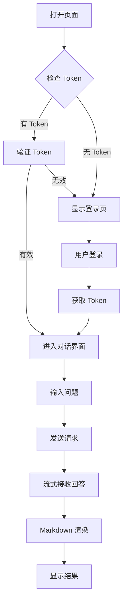

# NebulaRAG 前端界面产品需求文档

## 1. 产品概述

NebulaRAG 是一个基于 RAG（检索增强生成）技术的企业级知识库问答系统。本项目为其重写现代化前端界面，提供极简科技风格的 AI 对话体验，支持多角色权限隔离、文档上传、历史会话管理等核心功能。

**目标用户**：企业内部员工（admin 管理员、employee 普通员工）

**核心价值**：通过向量化知识库检索 + 大模型生成，实现精准的企业知识问答服务

## 2. 核心功能

### 2.1 用户角色

| 角色 | 登录方式 | 核心权限 |
|------|---------|---------|
| admin（管理员） | 用户名密码登录 | 访问公共知识库 + admin 专属知识库 |
| employee（员工） | 用户名密码登录 | 访问公共知识库 + employee 专属知识库 |

### 2.2 功能模块

1. **登录页面**：用户认证、Token 管理、演示账号展示
2. **对话界面**：Markdown 渲染、流式打字效果、代码高亮、一键复制
3. **侧边栏**：历史会话列表、新建/删除/重命名会话、角色标识展示
4. **文件上传**：拖拽上传、粘贴图片、文件格式校验
5. **消息管理**：骨架屏加载、空状态引导、滚动到底部提示

### 2.3 页面详情

| 页面名称 | 模块名称 | 功能描述 |
|---------|---------|---------|
| 登录页 | 认证表单 | 用户名密码输入、登录状态保持、错误提示 |
| 登录页 | 演示账号 | 展示 admin/employee 测试账号信息 |
| 对话页 | 消息列表 | Markdown 渲染、代码高亮、消息动画、时间戳 |
| 对话页 | 输入区 | 多行自适应、Enter 发送、Shift+Enter 换行、文件拖拽 |
| 对话页 | 侧边栏 | 会话列表、角色标识、新建/删除/重命名操作 |
| 对话页 | 工具栏 | 滚动到底部按钮、文件上传状态 |

## 3. 核心流程

## 4. 用户界面设计

### 4.1 设计风格

- **主色调**：靛蓝 #4F46E5
- **背景色**：纯白 #FFFFFF
- **辅助色**：灰色系 #F9FAFB、#E5E7EB、#6B7280
- **字体**：Inter（英文）+ Noto Sans SC（中文）
- **圆角**：对话气泡 16px，按钮 12px，输入框 12px
- **阴影**：轻量级阴影，层次分明
- **布局**：左侧边栏 + 右侧对话区的 Flexbox 布局

### 4.2 页面设计概览

| 页面名称 | 模块名称 | UI 元素 |
|---------|---------|--------|
| 登录页 | 认证表单 | 居中卡片布局、靛蓝主色调按钮、圆角输入框 |
| 对话页 | 消息列表 | 左对齐 AI 消息、右对齐用户消息、16px 圆角气泡 |
| 对话页 | 输入区 | 底部固定、多行自适应文本框、发送按钮带 loading |
| 对话页 | 侧边栏 | 280px 宽度、深色背景、会话列表、角色标签 |

### 4.3 响应式设计

- **桌面端**：侧边栏常驻显示，对话区占据剩余空间
- **移动端**：侧边栏自动隐藏，转换为底部抽屉菜单，点击汉堡按钮展开

### 4.4 微交互设计

- 按钮 hover/active 态平滑过渡（0.2s ease）
- 消息出现时淡入上浮动画（translateY + opacity）
- 滚动到底部悬浮提示按钮
- 发送按钮 loading 旋转动画
- 文件拖拽区域高亮反馈

## 5. 技术约束

- 单文件 HTML（内联 CSS + JS）
- 仅使用 CDN 引入：TailwindCSS、marked.js、highlight.js
- 不使用 React/Vue 等构建工具
- CSS 优先使用 Flexbox/Grid 布局
- 所有颜色、圆角、阴影使用 CSS 变量定义
- JS 做好错误处理，API 失败显示 Toast 提示
