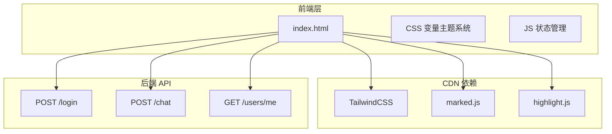

# NebulaRAG 前端技术架构文档

## 1. 架构设计



## 2. 技术描述

- **前端**：原生 HTML5 + CSS3 + ES6+
- **样式框架**：TailwindCSS@3（CDN）
- **Markdown 渲染**：marked.js@12（CDN）
- **代码高亮**：highlight.js@11（CDN）
- **后端**：FastAPI（已有）
- **认证**：JWT Token（Bearer）

## 3. 路由定义

| 路由 | 用途 |
|------|------|
| / | 首页，返回 index.html |
| /login | 用户登录（POST） |
| /chat | 聊天接口（POST，FormData） |
| /users/me | 获取当前用户信息（GET） |

## 4. API 定义

### 4.1 登录接口

```
POST /login
Content-Type: application/x-www-form-urlencoded

请求参数：
- username: string（用户名）
- password: string（密码）

响应：
{
  "access_token": "eyJ...",
  "token_type": "bearer"
}
```

### 4.2 聊天接口

```
POST /chat
Authorization: Bearer <token>
Content-Type: multipart/form-data

请求参数：
- question: string（用户问题）
- history: string（JSON 格式的历史记录）
- file: File（可选，上传的文件）

响应：
{
  "answer": "AI 回答内容",
  "history": [...]
}
```

### 4.3 用户信息接口

```
GET /users/me
Authorization: Bearer <token>

响应：
{
  "username": "admin",
  "role": "admin"
}
```

## 5. 数据模型

### 5.1 会话数据结构

```javascript
{
  id: "uuid",
  title: "会话标题",
  createdAt: "2024-01-01T00:00:00Z",
  messages: [
    {
      role: "user",
      content: "用户消息"
    },
    {
      role: "assistant",
      content: "AI 回答"
    }
  ]
}
```

### 5.2 用户状态

```javascript
{
  token: "jwt_token_string",
  user: {
    username: "admin",
    role: "admin"
  }
}
```

## 6. 组件结构

```
index.html
├── 登录模块
│   ├── 登录表单
│   └── 演示账号展示
├── 对话模块
│   ├── 侧边栏
│   │   ├── 角色标识
│   │   ├── 新建会话按钮
│   │   └── 会话列表
│   ├── 消息区域
│   │   ├── 空状态引导
│   │   ├── 消息气泡
│   │   └── 骨架屏加载
│   └── 输入区域
│       ├── 文件拖拽区
│       ├── 文本输入框
│       └── 发送按钮
└── 工具模块
    ├── Toast 提示
    └── 滚动到底部按钮
```

## 7. CSS 变量定义

```css
:root {
  /* 主色调 */
  --primary: #4F46E5;
  --primary-hover: #4338CA;
  --primary-light: #EEF2FF;
  
  /* 背景色 */
  --bg-primary: #FFFFFF;
  --bg-secondary: #F9FAFB;
  --bg-tertiary: #F3F4F6;
  
  /* 文字色 */
  --text-primary: #111827;
  --text-secondary: #6B7280;
  --text-tertiary: #9CA3AF;
  
  /* 边框色 */
  --border: #E5E7EB;
  --border-hover: #D1D5DB;
  
  /* 阴影 */
  --shadow-sm: 0 1px 2px rgba(0,0,0,0.05);
  --shadow-md: 0 4px 6px rgba(0,0,0,0.1);
  --shadow-lg: 0 10px 15px rgba(0,0,0,0.1);
  
  /* 圆角 */
  --radius-sm: 8px;
  --radius-md: 12px;
  --radius-lg: 16px;
  --radius-full: 9999px;
}
```
